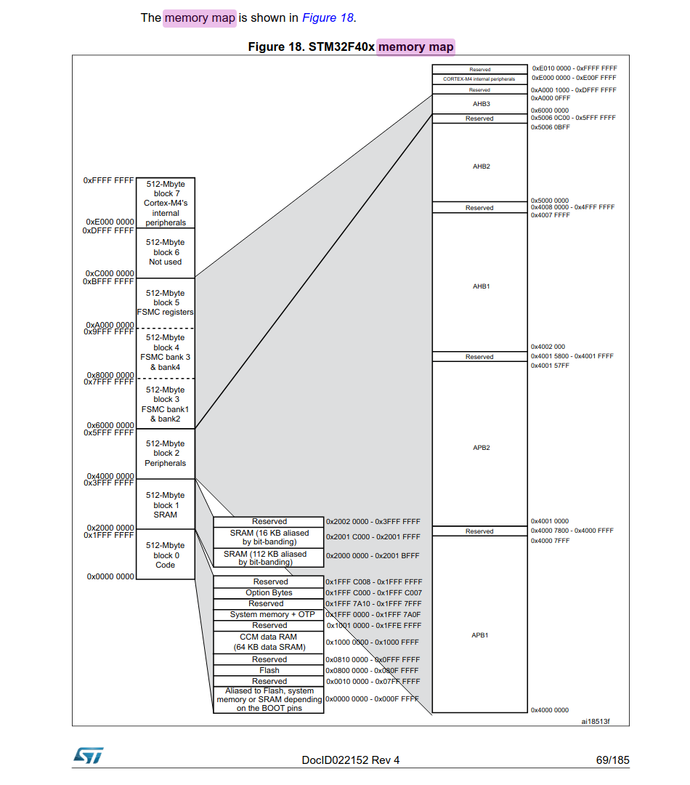
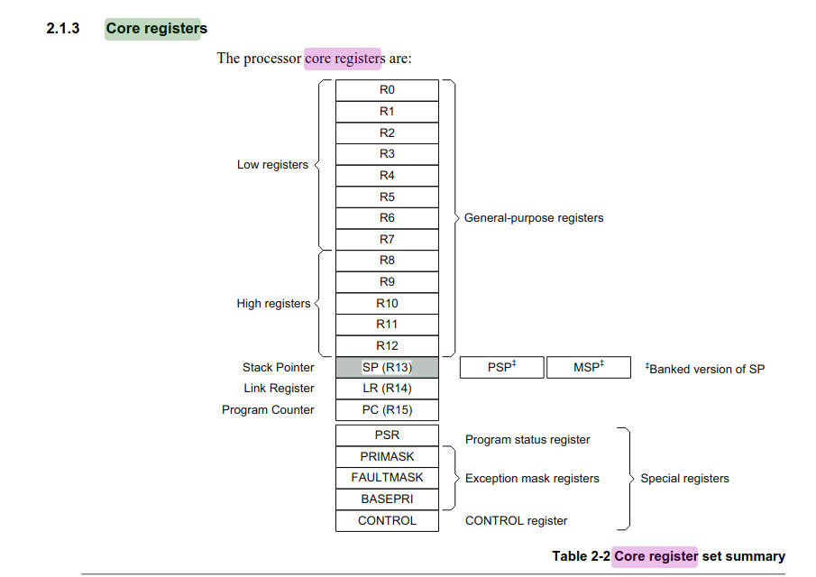
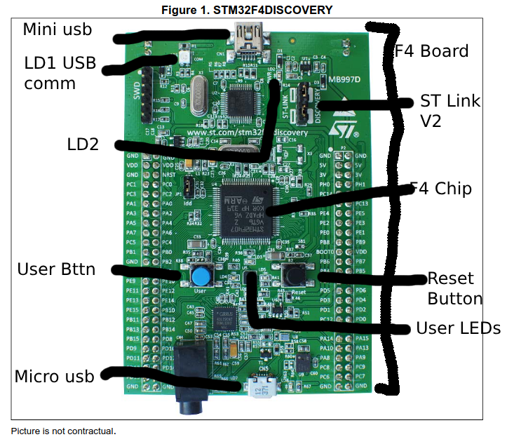

## Benjamin Blodgett & Erik Garringer / Group 5 / Lab 1

# Part 0
1. DigiKey: 497-16287-ND $20.91, ST: STM32F407G-DISC1 $20.49
2. USB cable connected to PC, or by using an external power supply via dedicated pins on board
3. 1.8 to 3.6 V
4. Blue and black are user and reset
5. 8 LEDs, LD1 (red / green) usb communication, LD2 (red) for 3.3V POWER ON, 4 user LEDs: LD3 (orange), LD4 (green), LD5 (red), LD6 (blue), 2 USB OTG LEDs: LD7 (green) VBUS, LD8 (red) overcurrent
6. 497-11605-ND
7. OTG Micro USB, Mini USB (A/B)
8. In-circuit debugger/programmer
9. 497-10484-ND $22.29
10. On-Chip-Debugger
11. LQFP64 
12. 497-11605-ND
13. 1 MB flash, 192 KB of RAM
14. 168MHz
15. low-profile quad flat package
16. 100
17. 
18. Little endian. Lowest numbered byte in a word is considered least significant byte. The highest numbered is the word's most significant byte.
19. 
20. 13

# Part 1

# Part 6
21. Pressing User button once per second gradually speeds up tempo of LEDs cycling until it eventually stops visibly speeding up.
