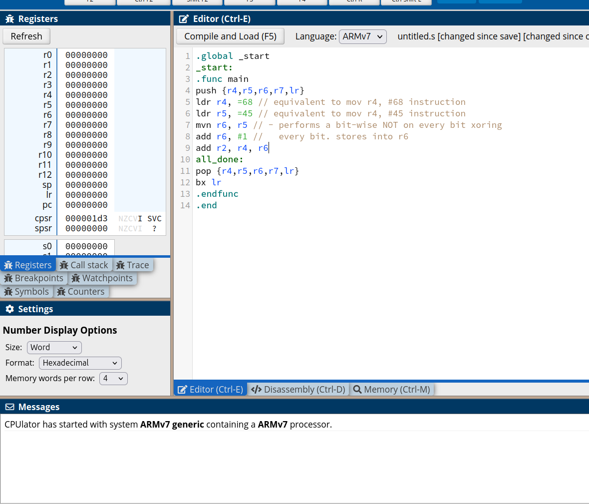
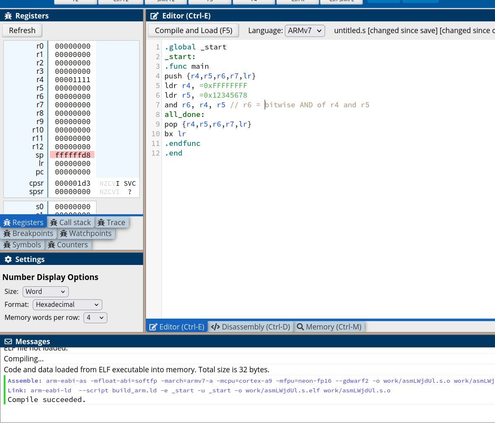
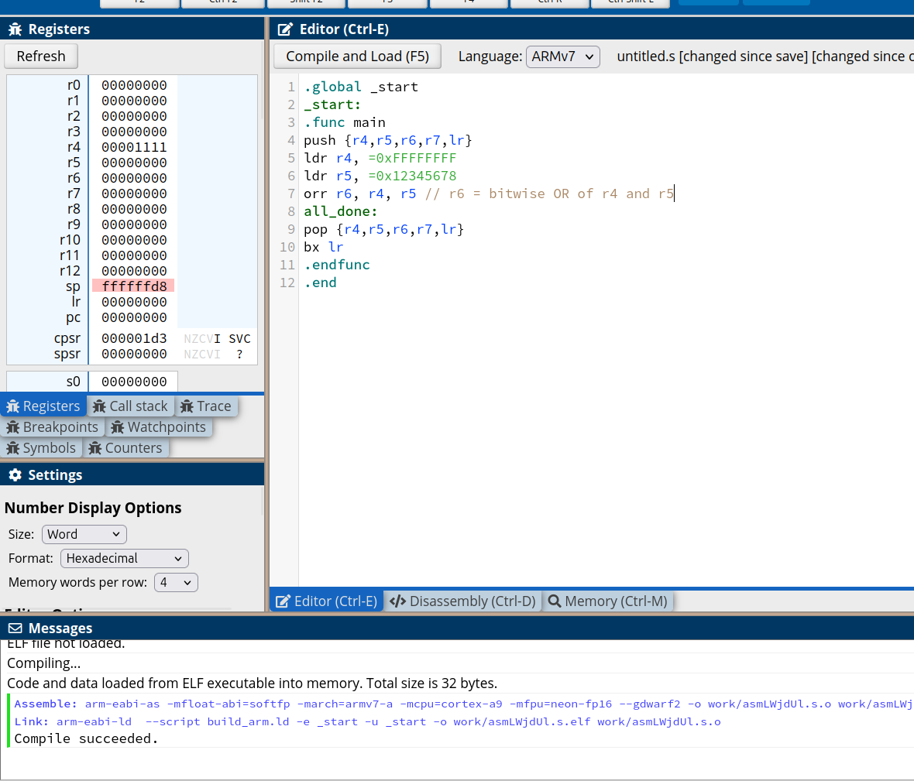
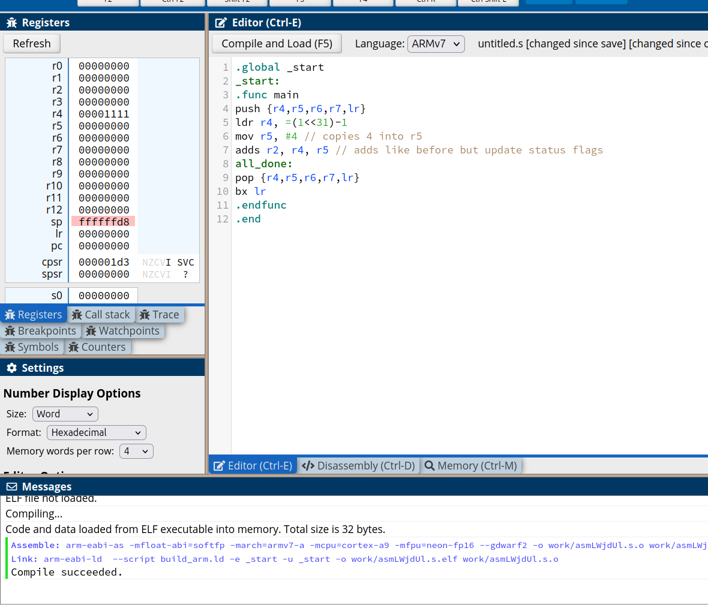
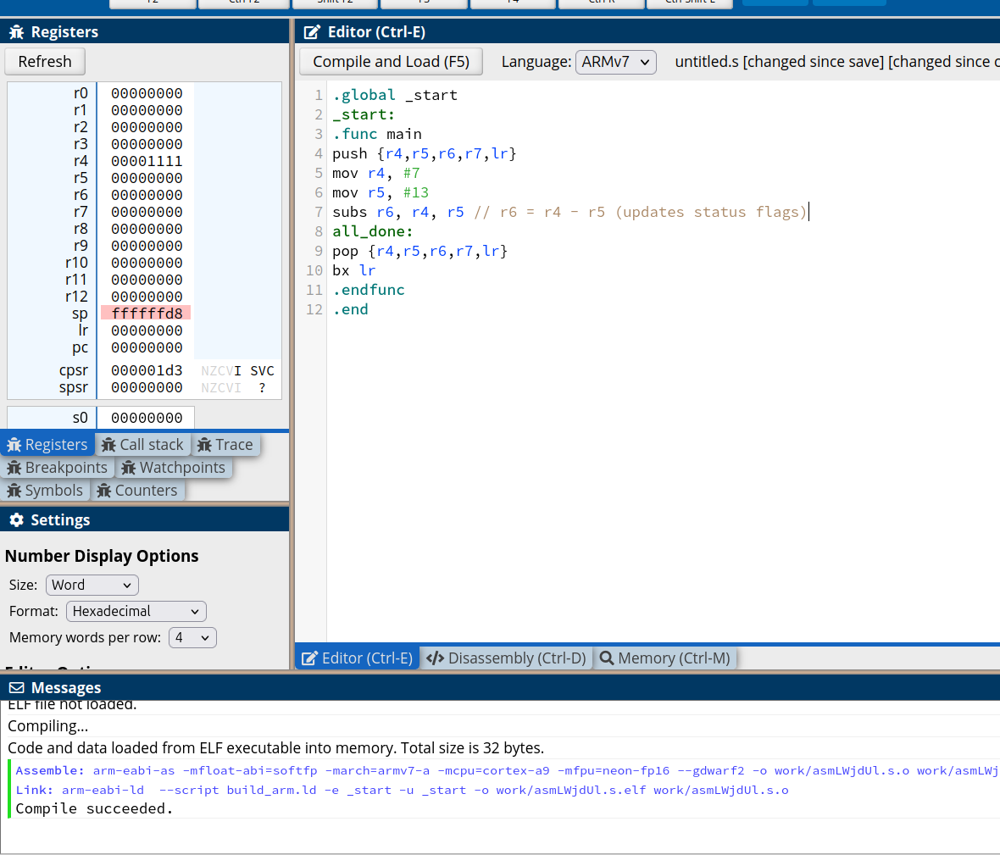

## Benjamin Blodgett & Erik Garringer / Group 5 / Lab 3

# Part 2

## a

Part 2A loops over and over. It adds 68 to 45 and stores the result into r2.

$$r_2 = r_4 + r_5$$

## b

Part 2B also loops over and over. It subtracts 45 from 68 and stores the result into r2.

$$r_2 = r_4 - r_5$$

## c

First invert every bit of r6, then add 1, then add r4. The result is assigned to r2.

$$r_2 = r_4 + ( 1 + \neg r_6 )$$

## d

First shift 15 left 3 times, then 2 times, finally, assign the result to r4.

$$r_4 = (15 \ll 3) \gg 2$$

## e

R6 is the result of logical and between r4 and r5.

$$r_6 = r_4 \land r_5$$

## f

R6 is the result of logical or between r4 and r5.

$$r_6 = r_4 \lor r_5$$

# Part 3

## 9

### 1

No for integers because we use two's complement and that doesn't allow for negative zero. Yes though maybe for certain floating point standards.

### 2

If the sign changes + to - and you added then you overflowed. The converse is true for subtraction. This is how the flags are set.

## a

This is the same as 2a but the status flags get updated (addition). The negative and overflow flag are set.

$$r_2 = r_4 + r_5$$

## b

This is the same as 2b but the status flags get updated (subtraction). In this case the negative only the flag is set.

$$r_2 = r_4 - r_5$$
